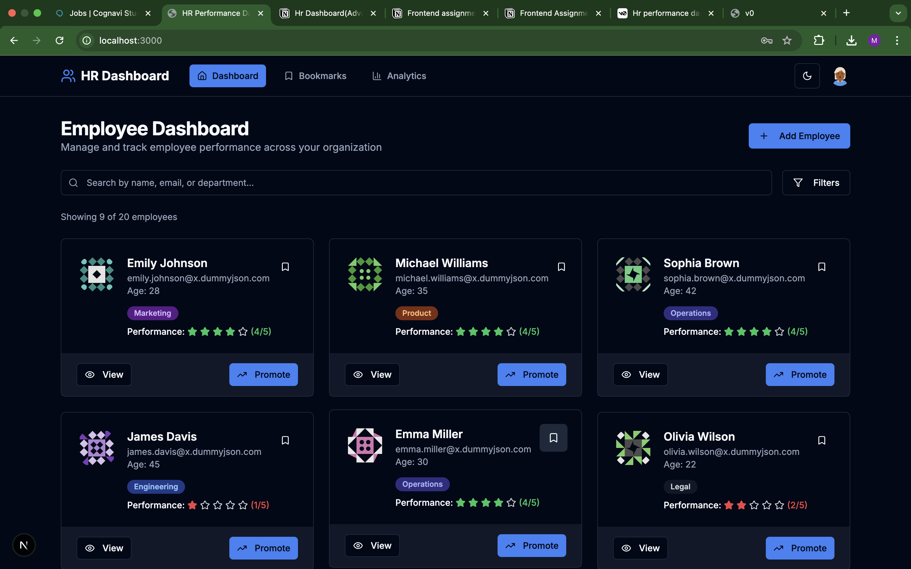
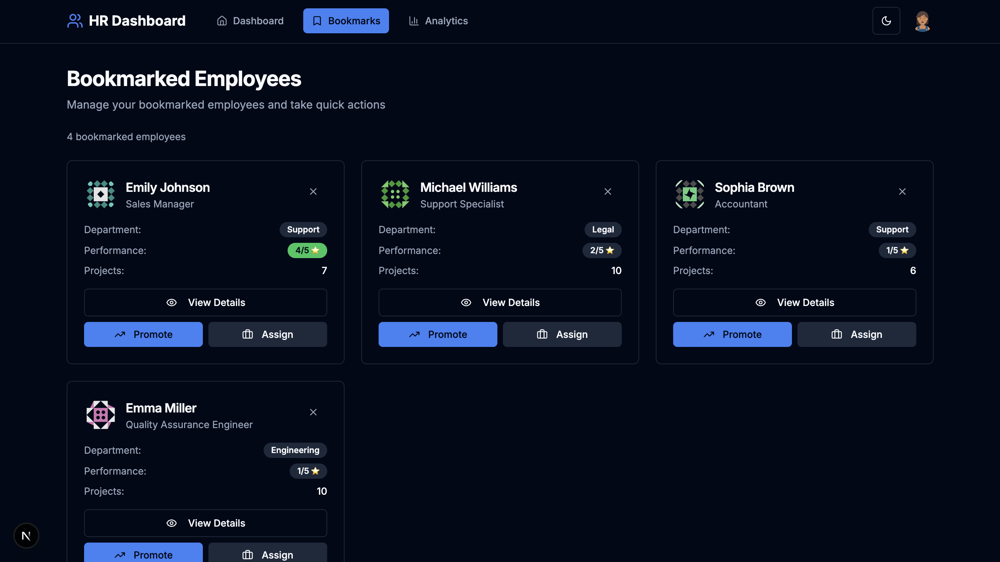
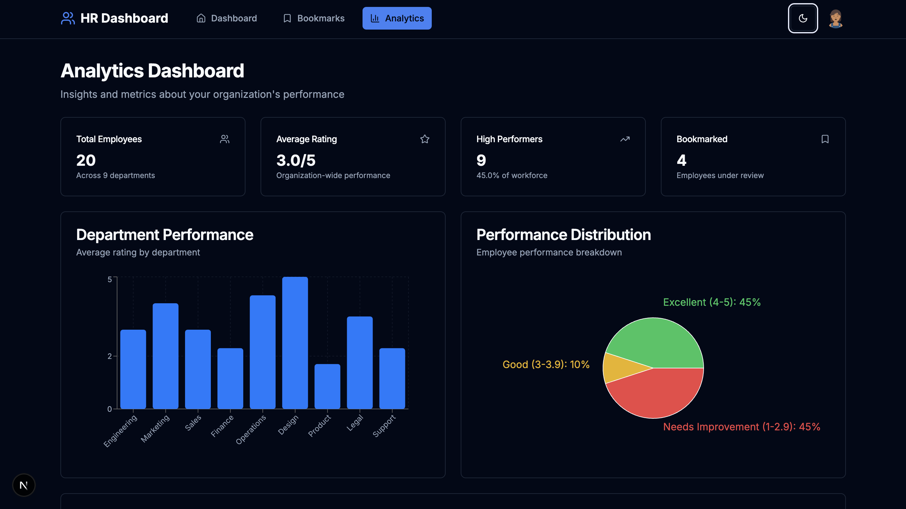
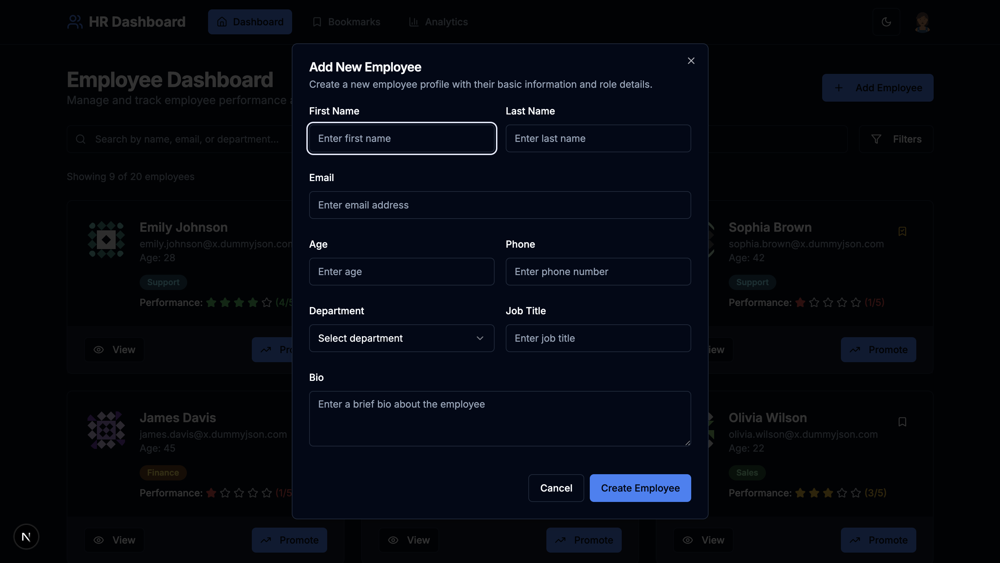
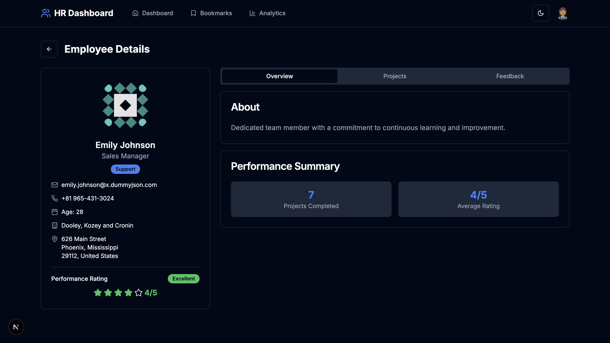

Great work completing the project! Here's a professional and well-structured `README.md` file for your **HR Dashboard (Advanced)**:

---


# 💼 HR Dashboard (Advanced)

A feature-rich, responsive **HR Performance Dashboard** built with **Next.js**, **React**, and **Tailwind CSS**. This tool allows HR Managers to efficiently track employee performance, manage bookmarks, and analyze data through beautiful visualizations.

---

## 🔧 Tech Stack

- **Frontend Framework:** React (Next.js App Router)
- **Styling:** Tailwind CSS
- **Language:** JavaScript (ES6+)
- **State Management:** Context API / Zustand
- **Data Visualization:** Chart.js
- **Authentication (Optional Bonus):** NextAuth.js

---

## 🚀 Features

### 🏠 Dashboard Homepage (`/`)
- Fetches dummy users from [DummyJSON](https://dummyjson.com/users?limit=20)
- Displays user cards with:
  - Full Name, Email, Age, Department
  - Performance Rating (1–5 stars)
  - Buttons for `View`, `Bookmark`, and `Promote`

### 🔍 Search & Filter
- Real-time search (case-insensitive) by name, email, or department
- Multi-select filter for departments and performance rating

### 👤 Dynamic Employee Page (`/employee/[id]`)
- Detailed profile with address, phone, bio, and past performance history
- Rating stars and color-coded performance badges
- Tabbed UI (`Overview`, `Projects`, `Feedback`) with mock data

### 📌 Bookmarks (`/bookmarks`)
- View and manage bookmarked employees
- Actions: Remove bookmark, Promote, or Assign to Project

### 📊 Analytics (`/analytics`)
- Department-wise average ratings (Bar chart)
- Bookmark trends (mocked)
- Built using Chart.js

---

## ⚙️ Technical Highlights

- ✅ **Next.js App Router**
- ✅ Client & server-side data fetching
- ✅ Custom Hooks: `useBookmarks`, `useSearch`
- ✅ Reusable components: `Card`, `Badge`, `Modal`, `Button`, `Tabs`, etc.
- ✅ Responsive design (Mobile → Desktop)
- ✅ Dark/Light mode toggle via Tailwind
- ✅ Loading & error states for components
- ✅ Clean folder structure: `components/`, `hooks/`, `lib/`, `app/`

---

## 🌟 Bonus Features

- ✅ Authentication with **NextAuth.js**
- ✅ Create User modal with basic form validation
- ✅ Pagination / Infinite Scroll for user list
- ✅ Animated tab/content transitions (Framer Motion)
There’s a small issue with your **screenshots table**: the column headers and the number of images don't match. You have **3 headers**, but **6 images**, so the layout will break in markdown rendering.

Here’s a corrected and enhanced version of the **screenshots section** in your README:

---

### 📸 Screenshots

| Dashboard                               | Bookmarks                               | Analytics                               |
| --------------------------------------- | --------------------------------------- | --------------------------------------- |
|  |  |  |

| Create Employee                                   | Employee Details                                    | Sign In                           |
| ------------------------------------------------- | --------------------------------------------------- | --------------------------------- |
|  |  |  |

---


## 🛠️ Getting Started

### 1. Clone the repository
```bash
git clone https://github.com/yourusername/hr-dashboard.git
cd hr-dashboard
````

### 2. Install dependencies

```bash
npm install
# or
yarn install
```

### 3. Run the development server

```bash
npm run dev
# or
yarn dev
```

Visit `http://localhost:3000` to view the app.

---

## 📁 Folder Structure

```
app/
├── employee/
│   └── [id]/       // Dynamic user details page
├── bookmarks/      // Bookmarked employees
├── analytics/      // Analytics dashboard
├── components/     // Reusable UI components
├── hooks/          // Custom hooks (e.g., useBookmarks)
├── lib/            // Utility functions / data logic
├── context/        // Context API or Zustand store
```

---

## 🙌 Acknowledgements

* [DummyJSON API](https://dummyjson.com/)
* [randomuser.me](https://randomuser.me/)
* [Chart.js](https://www.chartjs.org/)
* [NextAuth.js](https://next-auth.js.org/)
* [Framer Motion](https://www.framer.com/motion/)

---

